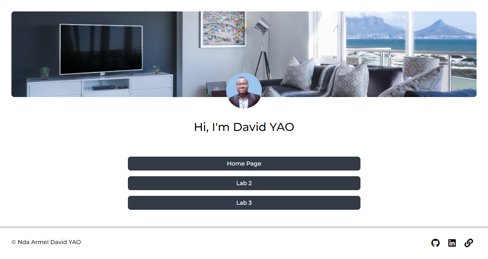

# Lab 1 WAP: homepage

> Clone of The News Week webpage with responsive layout

Instructions of the assignment:
- Your new homepage should have a couple of different items:
- Your name
- Your picture
- An unordered list with an item for each days assignment

## Built With

- HTML5
- CSS3

## Live Demo

[Live Demo Link](https://daviidy.github.io/news-week-clone/)

## Authors

👤 **David YAO**

- GitHub: [@daviidy](https://github.com/daviidy)
- Twitter: [@DavidYao3](https://twitter.com/DavidYao3)
- LinkedIn: [@DavidYao](https://www.linkedin.com/in/david-yao-armel/?locale=en_US)

## 🤝 Contributing

Contributions, issues, and feature requests are welcome!
